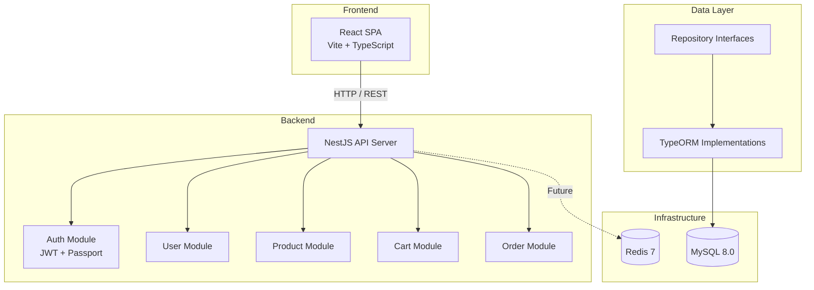

# ShopForge

A full-stack e-commerce platform built with NestJS and React.

## Tech Stack

- **Backend:** NestJS (TypeScript), TypeORM
- **Frontend:** React (TypeScript) + Vite
- **Database:** MySQL 8.0
- **Cache:** Redis 7
- **Auth:** JWT (passport-jwt)

## Getting Started

### Prerequisites

- Node.js >= 18
- Docker & Docker Compose
- npm

### Setup

1. Clone the repository:
   ```bash
   git clone https://github.com/ayyanar-03/shopforge.git
   cd shopforge
   ```

2. Start MySQL and Redis:
   ```bash
   docker-compose up -d
   ```

3. Install and run the backend:
   ```bash
   cd backend
   npm install
   npm run start:dev
   ```
   The API runs at `http://localhost:3000`.

4. Install and run the frontend:
   ```bash
   cd frontend
   npm install
   npm run dev
   ```
   The app runs at `http://localhost:5173`.

### Environment Variables (backend)

| Variable      | Default            | Description         |
|---------------|--------------------|---------------------|
| `DB_HOST`     | `localhost`        | MySQL host          |
| `DB_PORT`     | `3306`             | MySQL port          |
| `DB_USER`     | `shopforge_user`   | MySQL username      |
| `DB_PASSWORD` | `shopforge_pass`   | MySQL password      |
| `DB_NAME`     | `shopforge`        | MySQL database name |
| `JWT_SECRET`  | `shopforge-dev-secret` | JWT signing key |
| `PORT`        | `3000`             | API server port     |

### Running Tests

```bash
cd backend
npm test
```

## Architecture



### Data Flow

1. **Authentication:** Client sends credentials to `/auth/signup` or `/auth/login`, receives a JWT token.
2. **Products:** Public CRUD endpoints at `/products`. No auth required for read operations.
3. **Cart:** Authenticated users manage cart items via `/cart`. Items reference products.
4. **Orders:** `POST /orders` creates an order from the current cart, decrements product stock, and clears the cart.

### Repository Pattern

Each domain module defines a repository interface (e.g., `IProductRepository`) separate from its TypeORM implementation. Services depend on the interface via dependency injection, making the data layer swappable without changing business logic.

## API Endpoints

| Method | Endpoint         | Auth | Description              |
|--------|------------------|------|--------------------------|
| POST   | /auth/signup     | No   | Register a new user      |
| POST   | /auth/login      | No   | Login and get JWT token  |
| GET    | /products        | No   | List all products        |
| GET    | /products/:id    | No   | Get product details      |
| POST   | /products        | No   | Create a product         |
| PUT    | /products/:id    | No   | Update a product         |
| DELETE | /products/:id    | No   | Delete a product         |
| GET    | /cart            | Yes  | Get cart items           |
| POST   | /cart            | Yes  | Add item to cart         |
| DELETE | /cart/:id        | Yes  | Remove cart item         |
| DELETE | /cart            | Yes  | Clear cart               |
| POST   | /orders          | Yes  | Place order from cart    |
| GET    | /orders          | Yes  | List user's orders       |
| GET    | /orders/:id      | Yes  | Get order details        |

## Project Structure

```
shopforge/
├── backend/
│   └── src/
│       ├── auth/              # JWT strategy and guard
│       ├── users/             # User entity, service, controller, repository
│       ├── products/          # Product CRUD with repository pattern
│       ├── cart/              # Cart management
│       ├── orders/            # Order placement and stock management
│       ├── app.module.ts      # Root module with TypeORM config
│       └── main.ts            # Bootstrap with CORS and validation
├── frontend/
│   └── src/
│       ├── context/           # Auth context provider
│       ├── components/        # Shared components (Navbar)
│       ├── pages/             # Page components
│       ├── api.ts             # Axios client with auth interceptor
│       └── App.tsx            # Router setup
├── docs/adr/                  # Architecture Decision Records
├── docker-compose.yml         # MySQL + Redis
├── CHANGELOG.md
└── README.md
```

## License

MIT
