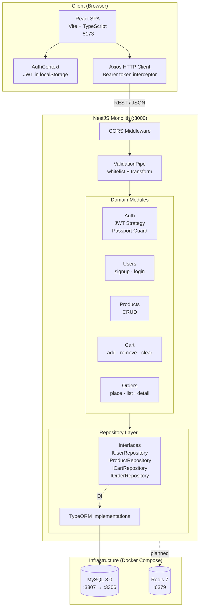

# ShopForge

A full-stack e-commerce platform built with NestJS and React.

## Architecture



### Data Flow

1. **Authentication:** Client sends credentials to `/auth/signup` or `/auth/login`, receives a JWT token stored in localStorage.
2. **Products:** Public CRUD endpoints at `/products`. No auth required for read operations.
3. **Cart:** Authenticated users manage cart items via `/cart`. Items reference products with eager-loaded relations.
4. **Orders:** `POST /orders` validates stock, creates an order from the current cart, decrements product stock, and clears the cart atomically.

### Repository Pattern

Each domain module defines a repository interface (e.g., `IProductRepository`) separate from its TypeORM implementation. Services depend on the interface via NestJS dependency injection (`@Inject` + token), making the data layer swappable without changing business logic.

## Tech Stack

| Layer          | Technology                          |
|----------------|-------------------------------------|
| Frontend       | React 19, TypeScript, Vite 8        |
| Backend        | NestJS 11, TypeScript, TypeORM      |
| Auth           | JWT via passport-jwt, bcrypt        |
| Database       | MySQL 8.0                           |
| Cache          | Redis 7 (provisioned, not yet used) |
| Containerization | Docker Compose                    |

## Getting Started

### Prerequisites

- Node.js >= 18
- Docker & Docker Compose (or locally installed MySQL and Redis)
- npm

### 1. Clone the repository

```bash
git clone https://github.com/ayyanar-03/shopforge.git
cd shopforge
```

### 2. Start infrastructure

**Option A — Docker (recommended):**

```bash
docker-compose up -d
```

This starts MySQL on port **3307** and Redis on port **6379**.

**Option B — Local services:**

If Docker is unavailable, install MySQL and Redis locally. Ensure MySQL is running on port 3307 (or update `DB_PORT` in your environment).

### 3. Install and run the backend

```bash
cd backend
npm install
npm run start:dev
```

The API starts at `http://localhost:3000`. TypeORM `synchronize: true` auto-creates tables on first run.

### 4. Install and run the frontend

```bash
cd frontend
npm install
npm run dev
```

The app starts at `http://localhost:5173`.

### Environment Variables

| Variable      | Default              | Description         |
|---------------|----------------------|---------------------|
| `DB_HOST`     | `localhost`          | MySQL host          |
| `DB_PORT`     | `3307`               | MySQL port          |
| `DB_USER`     | `shopforge_user`     | MySQL username      |
| `DB_PASSWORD` | `shopforge_pass`     | MySQL password      |
| `DB_NAME`     | `shopforge`          | MySQL database name |
| `JWT_SECRET`  | `shopforge-dev-secret` | JWT signing key   |
| `PORT`        | `3000`               | API server port     |

### Running Tests

```bash
cd backend
npm test
```

## API Endpoints

| Method | Endpoint         | Auth | Description              |
|--------|------------------|------|--------------------------|
| POST   | /auth/signup     | No   | Register a new user      |
| POST   | /auth/login      | No   | Login and get JWT token  |
| GET    | /products        | No   | List all products        |
| GET    | /products/:id    | No   | Get product details      |
| POST   | /products        | No   | Create a product         |
| PUT    | /products/:id    | No   | Update a product         |
| DELETE | /products/:id    | No   | Delete a product         |
| GET    | /cart            | Yes  | Get cart items           |
| POST   | /cart            | Yes  | Add item to cart         |
| DELETE | /cart/:id        | Yes  | Remove cart item         |
| DELETE | /cart            | Yes  | Clear cart               |
| POST   | /orders          | Yes  | Place order from cart    |
| GET    | /orders          | Yes  | List user's orders       |
| GET    | /orders/:id      | Yes  | Get order details        |

## Performance

Redis cache-aside caching on product endpoints, with `@SkipThrottle()` on read routes. Benchmarked with [autocannon](https://github.com/mcollina/autocannon) (10 connections, 10s duration, 50 products in DB).

| Metric | Before (MySQL only) | After (Redis cache) | Change |
|--------|--------------------:|--------------------:|-------:|
| Req/sec | 2,742 | 3,223 | +17.5% |
| Latency avg | 3.15 ms | 2.55 ms | -19.0% |
| Latency p50 | 2 ms | 2 ms | — |
| Latency p99 | 12 ms | 6 ms | -50.0% |
| Throughput | 1,044 KB/s | 14,478 KB/s | +13.9x |

> **Note:** The "Before" run was affected by the global rate limiter (60 req/min), causing most requests to return 429. The "After" run uses `@SkipThrottle()` on product GET endpoints, so all 32k requests hit the cache path. The throughput increase is primarily from returning paginated JSON (vs. 429 responses) and Redis serving cached results.

Run the benchmark yourself:

```bash
node scripts/load-test.js http://localhost:3000/products
```

## Project Structure

```
shopforge/
├── backend/
│   └── src/
│       ├── auth/              # JWT strategy, guards, RBAC, refresh tokens
│       ├── cache/             # Redis cache-aside service
│       ├── common/            # Shared DTOs (pagination)
│       ├── users/             # User entity, service, controller, repository
│       ├── products/          # Product CRUD with repository pattern + caching
│       ├── cart/              # Cart management
│       ├── orders/            # Order placement and stock management
│       ├── app.module.ts      # Root module with TypeORM + Throttler + Redis
│       └── main.ts            # Bootstrap with CORS and validation
├── frontend/
│   └── src/
│       ├── context/           # Auth context provider
│       ├── components/        # Shared components (Navbar)
│       ├── pages/             # Page components
│       ├── api.ts             # Axios client with auth interceptor
│       └── App.tsx            # Router setup
├── docs/adr/                  # Architecture Decision Records
├── docker-compose.yml         # MySQL + Redis
├── CHANGELOG.md
└── README.md
```

## License

MIT
